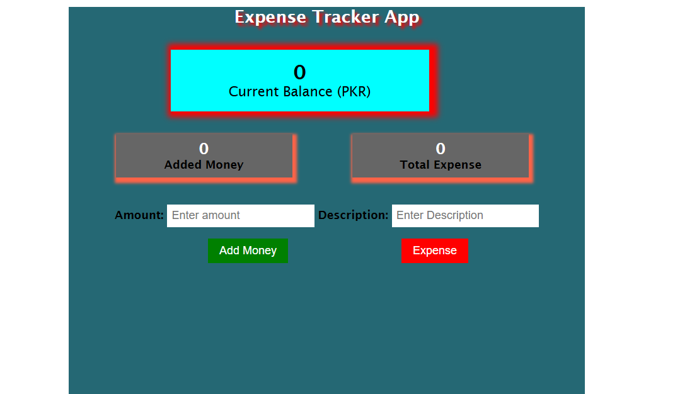

# Expense Tracker

A simple Expense Tracker web application built using HTML, CSS, and JavaScript.  
This project was created during my frontend web development learning journey to practice JavaScript functionality and DOM manipulation.

---

## Overview

The Expense Tracker helps users manage their income and expenses by allowing them to:

- Add transactions
- Track income and expenses
- Calculate total balance

The main goal of this project was to improve my understanding of JavaScript logic, local storage, and dynamic UI updates.

---

## Features

- Add income and expense transactions
- Automatically calculate balance
- Track total income and expenses
- Delete transactions
- Responsive user interface
- Data stored using Local Storage

---

## 🛠️ Technologies Used

- HTML5
- CSS3
- JavaScript (ES6)

---

## 📂 Project Structure

```bash
expense-tracker/
│
├── index.html
├── style.css
├── script.js
├── screenshots/
└── README.md
```

---

## 📸 Screenshots

### Expense Tracker UI



---

## What I Learned

Through this project, I learned:

- JavaScript DOM manipulation
- Event handling
- Working with arrays and objects
- Local Storage usage
- Dynamic UI updates
- Basic financial tracking logic

---

## Future Improvements

Planned improvements for this project:

- Add charts and analytics
- Add categories for expenses
- Add monthly reports
- Add dark mode
- Improve mobile responsiveness
- Add backend/database integration

---


## Author

Muhammad Subhan Butt

- GitHub: https://github.com/muhammadsubhanbutt

---

## ⭐ Note

This project was built for educational and practice purposes as part of my web development journey.
